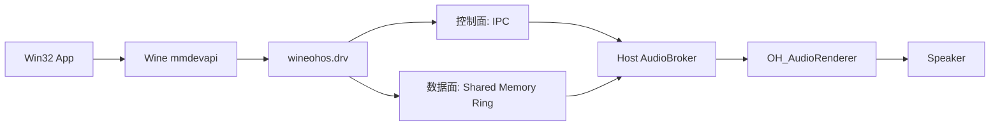

# Wine on HarmonyOS — 架构设计

## 1. Wine 内部架构

```
┌──────────────────────────────────────────────────────────┐
│              Windows PE 可执行文件 (.exe)                  │
│              x86_64 指令，PE 格式                          │
├──────────────────────────────────────────────────────────┤
│                    ntdll.dll (PE 侧)                      │
│   ┌──────────────────────────────────────────────────┐  │
│   │  loader.c   virtual.c   thread.c   heap.c         │  │
│   │  (PE 加载器，Windows 语义)                          │  │
│   └──────────────┬───────────────────────────────────┘  │
│                  │ __wine_syscall_dispatcher              │
│                  │ (汇编 trampoline: PE→Unix 上下文切换)    │
│                  ▼                                        │
├──────────────────────────────────────────────────────────┤
│              ntdll/unix/ (Unix 侧，原生 ELF .so)           │
│   ┌──────────────────────────────────────────────────┐  │
│   │  signal_x86_64.c   thread.c   virtual.c           │  │
│   │  server.c          loader.c   sync.c              │  │
│   │  (POSIX/Linux 系统调用，实现 NT 语义)               │  │
│   └──────────┬───────────────────────────────────────┘  │
│              │ Unix Domain Socket (sendmsg/recvmsg)       │
│              ▼                                            │
│         ┌──────────┐                                      │
│         │wineserver│  (独立进程，事件驱动的 I/O 循环)      │
│         └──────────┘                                      │
└──────────────────────────────────────────────────────────┘
```

### 关键层次

| 层 | 文件位置 | 编译目标 | 功能 |
|---|---------|---------|------|
| PE DLL | `dlls/ntdll/` (不含 `unix/`) | PE (x86_64-w64-mingw32) | Windows NT API 实现 |
| Unix .so | `dlls/ntdll/unix/` | ELF .so (native) | Unix 系统调用封装 |
| wineserver | `server/` | ELF 可执行文件 | 进程/线程管理，同步对象 |

### 桥接点

**(A) NT Syscall Dispatcher** (`__wine_syscall_dispatcher`)
- 位置: `dlls/ntdll/unix/signal_x86_64.c`
- 功能: PE 代码调用 NT 系统调用时，切换上下文到 Unix
- 关键 API: `arch_prctl(ARCH_SET_GS, ...)`, `arch_prctl(ARCH_SET_FS, ...)`

**(B) Unix Call Dispatcher** (`__wine_unix_call_dispatcher`)
- PE DLL 调用 Unix 函数 (如加载 Unix .so)

**(C) wineserver 通信**
- Unix Domain Socket (`sendmsg`/`recvmsg`)
- 每个线程一个 socket

---

## 2. 当前架构 (HarmonyOS ARM64)

```
┌──────────────────────────────────────────────────────────┐
│  Windows x86_64 程序 (notepad.exe 等)                     │
│        ↓ Box64 (x86_64 → ARM64 指令翻译)                  │
├──────────────────────────────────────────────────────────┤
│  Wine PE DLLs (x86_64) + Unix .so (x86_64, musl)         │
│        ↓ winewayland.drv                                 │
├──────────────────────────────────────────────────────────┤
│  Wayland compositor (ARM64 原生, HAP 内)                   │
│  ├── WaylandServer (wl_compositor, xdg_shell, wl_seat)   │
│  ├── InputManager (鼠标/键盘事件注入)                      │
│  └── EglRenderer (EGL/GLES → XComponent 上屏)            │
├──────────────────────────────────────────────────────────┤
│  HarmonyOS Kernel (ARM64, Linux 5.10/6.6)                 │
└──────────────────────────────────────────────────────────┘
```

ARM64 Pad 下，Box64 编译为共享库 (box64.so)，由 NCP 子进程 `wine_child.so:Main()` dlopen 加载，
`box64_hmos_main()` 在同一进程内模拟执行 x86_64 Wine ELF。编译宏 `LIBBOX64_SO` 控制。
x86_64 Pad 下 Wine 原生 .so 直接由系统 linker 加载，无需 Box64。

### 关键适配

| 组件 | 说明 |
|------|------|
| Box64 | x86_64 → ARM64 指令翻译，Dynarec 模式 |
| Wayland compositor | 嵌入式 compositor，在 HAP ARM64 进程中运行 |
| XKB 键盘 | xkeyboard-config 打包到 HNP，XKB_CONFIG_ROOT 指向 |
| noexec 文件系统 | 可执行段用匿名 mmap + pread 替代文件映射 |
| dosdevices | symlink 不可用，四条代码路径硬编码 fallback |

---

## 3. 信号处理

- `arch_prctl(ARCH_SET_GS, teb)` → 设置 GS 段基址 = TEB
- `arch_prctl(ARCH_SET_FS, teb)` → 设置 FS 段基址
- Wine 信号处理器: SIGSEGV, SIGILL, SIGBUS, SIGFPE

## 4. wineserver I/O 循环

4 层 fallback: `epoll_pwait2` → `epoll_wait` → `kqueue` → `poll()`  
HarmonyOS 使用 epoll (Linux 内核)，`epoll_pwait2` 在 musl 上 stub 返回 ENOSYS 后自动 fallback。

---

## 5. 当前音频路径

当前音频主线是:



关键点:

- 宿主 native 进程独占 `OH_AudioRenderer`
- Wine 侧只负责提交 PCM
- 控制面走 broker
- 数据面走共享内存
- 多进程混频在宿主侧完成

更详细的实现细节、日志策略和多格式验证边界见:

- [AUDIO_ARCHITECTURE.md](AUDIO_ARCHITECTURE.md)
