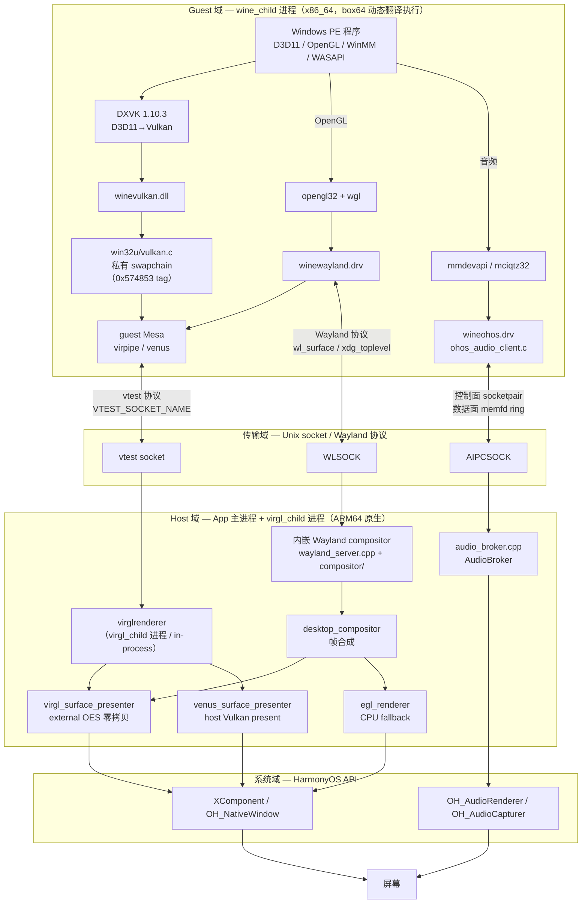
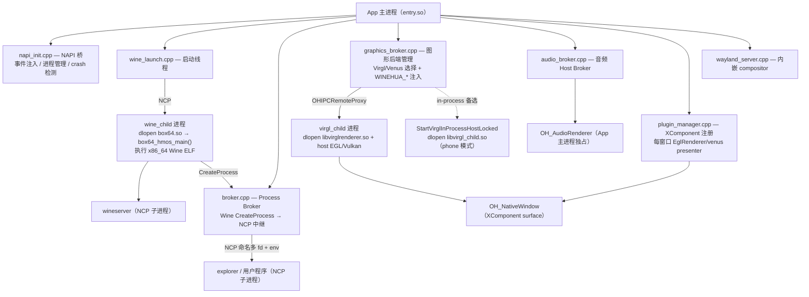
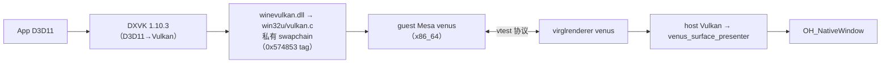
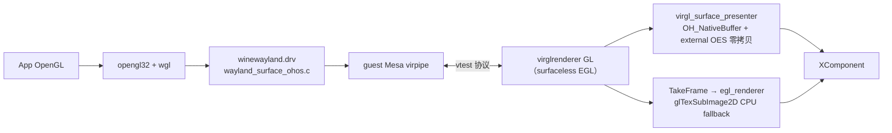
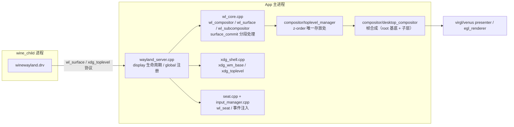
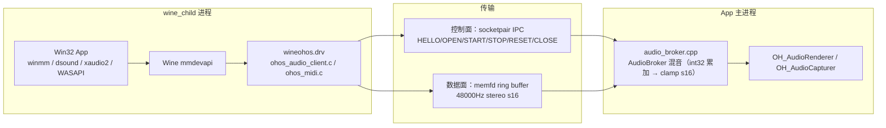

# WineHua 总体架构

> 更新日期: 2026-08-01
> 本文是**总览**：一张图讲清整个系统（wine / wayland compositor / 音频 / 图形四域）。
> 各域的详细设计见文末 [文档导航](#8-文档导航)。

## 0. 一句话

WineHua 在鸿蒙 App 进程内嵌一个 Wayland compositor，用 Wine（x86_64，经 box64 翻译执行）跑 Windows 程序：
图形命令经 vtest 协议转发到宿主 virglrenderer 翻译为 host GL/Vulkan，音频经 Unix socket + 共享内存桥接到宿主 OHAudio。

## 1. 总体架构图



四域速览：

| 域 | 运行位置 | 架构 | 核心文件 |
|----|---------|------|---------|
| Guest | `wine_child` 进程（box64 翻译执行 Wine） | x86_64 PE + Unix .so，musl | `thirdparty/wine/dlls/*` |
| 传输 | Unix socket（vtest / 音频 IPC）+ Wayland 协议 | 二进制协议 | `virgl_ipc_protocol.h`、`audio_ipc_protocol.h` |
| Host | App 主进程 + `virgl_child` 进程 | ARM64 原生 C++ | `entry/src/main/cpp/*` |
| 系统 | HarmonyOS API | OH_NativeWindow / OHAudio / NCP | 系统 SDK |

## 2. 进程拓扑



要点：

- **wine_child 是 Guest 域的容器**：box64 以共享库形式 dlopen 进 wine_child，`box64_hmos_main()` 在同一进程内模拟执行 x86_64 Wine ELF（见 [ARCHITECTURE.md](ARCHITECTURE.md) §2）。
- **Wine 内部 CreateProcess 经 Process Broker 中继到 NCP**：`broker.cpp` 在后台线程跑 Unix socket server，把 Wine 的进程创建请求转成 `OH_Ability_StartNativeChildProcess`，支持命名多 fd 和环境变量转发。
- **virglrenderer 有三种宿主形态**：IPC NCP 子进程（`OHIPCRemoteProxy`）、进程内 host（`StartVirglInProcessHostLocked`，phone 模式）、以及 NCP 子进程直连。图形后端的选择与切换由 `graphics_broker.cpp` 管理。
- **phone 模式**：系统 NCP 不可用时，`ncp_dispatch.cpp` 把 `OH_Ability_StartNativeChildProcess` 符号覆盖为 `phone_adapter/` 的 fork 实现（`phone_process.cpp`）。
- **音频 Host Broker 在 App 主进程内**：Wine 子进程不直接创建设备，宿主 native 进程独占 `OH_AudioRenderer`（设计原则见 [AUDIO_ARCHITECTURE.md](AUDIO_ARCHITECTURE.md)）。

## 3. 图形链路

两条链路，DXVK/Venus 为产品主路径，OpenGL 为显式 fallback（详见 [OPENGL_VIRGL_DESIGN.md](OPENGL_VIRGL_DESIGN.md)、[PHASE2_DXVK_STATUS_MEMO.md](PHASE2_DXVK_STATUS_MEMO.md)）。

### 3.1 D3D11 主路径（DXVK → Venus → host Vulkan）



- guest 侧 DXVK 的 present 走 `win32u/vulkan.c` 的**私有 swapchain**（`0x574853` tag），再经 guest Mesa venus 编码为 vtest 命令：`win32u` dlopen `libvulkan_virtio.so` 取 `vn_winehua_present` 入口，发私有命令 `VCMD_WINEHUA_VK_PRESENT`（0x57485650）；host 端 `vkr_renderer_winehua_present` 按 Venus 对象 ID 查表后 `vkQueuePresentKHR`。这三处（win32u swapchain / mesa vn_winehua_present / virglrenderer vkr_winehua_present）是**跨 fork 成对演进的私有接口**（见 `docs/submodule-patches/wine.md`、`mesa.md`、`virglrenderer.md`）。
- host 侧 `venus_surface_presenter.cpp` 把 virglrenderer 渲染的 Vulkan 图像经 OH_NativeWindow 上屏。
- **shadow 内存路径**：Maleoon 等设备无 dma-buf 导出，走匿名文件 shadow + memcpy 同步（flush/invalidate/GPU upload），profile 契约见 STATUS_MEMO。

### 3.2 OpenGL fallback 路径（VirGL）



- **zero-copy 已落地**：virgl 生效时传输模式为 `virgl_texture+surface_queue+external_oes`，`egl_renderer` 降为 CPU fallback，支持多窗口 per-surface zero-copy（surfaceKey 粒度）。
- 环境变量契约（`WINEHUA_GRAPHICS_BACKEND`、`WINEHUA_FRAME_TRANSPORT`、`VTEST_SOCKET_NAME` 等）以 [OPENGL_VIRGL_DESIGN.md](OPENGL_VIRGL_DESIGN.md) §宿主 ↔ guest 环境变量契约为准。

## 4. Wayland compositor 链路（窗口模型）

Wine guest 是 Wayland client（winewayland.drv），App 主进程内嵌 compositor 是 server：



- 状态（z-order、toplevel 聚合）收在 `compositor/` 的 owning classes（各头注释声明不变式）。协议层尚未瘦身为纯解析：`xdg_shell.cpp` 基本只管协议；`wl_core.cpp` 除 wl_compositor/surface/subcompositor/subsurface/viewporter 协议实现外，surface_commit 路径仍混有 SHM 上传/图像处理、窗口管理策略（位置同步、尺寸漂移重发 configure、root 识别）、popup 管理等协议外职责（收敛计划见 [COMPOSITOR_REFACTOR_PLAN.md](COMPOSITOR_REFACTOR_PLAN.md) 阶段 5）。
- `compositor/display_policy.h` 是 PC/Desktop 模式差异的策略查询唯一入口（事件派发 / subsurface / 渲染取帧 / 输入命中四类；phone 模式不经此，传输层隔离）。
- 输入链路：ArkTS 事件 → NAPI `SendPointerEvent/SendKeyEvent/SendScrollEvent` → `input_manager.cpp` 注入 → `wl_pointer/wl_keyboard` 事件 → Wine（调试 tag 速查见 `.claude/rules/build-and-log.md`）。
- 交互式窗口移动由 `compositor/move_grab.cpp` 实现（xdg_toplevel.move grab）。

## 5. 音频链路



- **控制面/数据面分离**：两级 fd 协议（bootstrap fd → private socketpair），命令走 IPC，PCM 走共享内存 ring；callback 只做取数、混音、补零，不做阻塞操作（详见 [AUDIO_ARCHITECTURE.md](AUDIO_ARCHITECTURE.md)）。
- 多进程混频：每个 Wine stream 一块独立 ring，宿主侧单个全局 `OH_AudioRenderer`，callback 混音所有 started stream。
- 当前覆盖：render（多 stream 混音）、capture（`WINEHUA_AUDIO_STREAM_FLAG_CAPTURE`）、MIDI 软合成（winehua-gm.sf2）。不做 exclusive mode / multichannel。

## 6. Wine 进程模型（guest 内部）

```
Windows PE 程序 ──► ntdll.dll (PE 侧, x86_64)
                        │ __wine_syscall_dispatcher（汇编 trampoline）
                        ▼
                   ntdll/unix/ (Unix 侧, ELF .so, musl)
                        │ Unix Domain Socket (sendmsg/recvmsg)
                        ▼
                   wineserver（独立进程，事件驱动 I/O 循环）
```

- PE↔Unix 分层与桥接点（`__wine_syscall_dispatcher` / `__wine_unix_call_dispatcher`）详见 [ARCHITECTURE.md](ARCHITECTURE.md) §1。
- 信号处理：`arch_prctl(ARCH_SET_GS/FS, teb)` 设置 GS/FS 段基址；wineserver I/O 循环 4 层 fallback（`epoll_pwait2` → `epoll_wait` → `kqueue` → `poll`），musl 上 `epoll_pwait2` stub 后自动降级。
- box64 适配要点（musl 移植、InternalMmap 三限制、mallochook）见 `docs/submodule-patches/box64.md`。

## 7. 模块索引

### Host 侧（entry/src/main/cpp/）

| 模块 | 文件 | 域 | 职责 |
|------|------|----|------|
| NAPI 桥 | `napi_init.cpp` | 进程 | PIPE 事件注入入口、Wine/wineserver/wineboot 进程管理、crash 检测 |
| Process Broker | `broker.cpp` | 进程 | Wine CreateProcess → NCP 中继（命名多 fd + env） |
| Wine 启动 | `wine_launch.cpp` | 进程 | 启动线程：wineserver/wineboot/explorer |
| NCP 路由 | `ncp_dispatch.cpp` + `phone_adapter/` | 进程 | phone 模式符号覆盖为 fork 实现 |
| Wayland 服务器 | `wayland_server.cpp` | compositor | display 生命周期、global 注册、单例组装点 |
| Wayland 协议 | `wl_core.cpp` | compositor | wl_compositor/surface/subcompositor/subsurface/viewporter |
| xdg 协议 | `xdg_shell.cpp` | compositor | xdg_wm_base/surface/toplevel |
| 输入 | `seat.cpp` + `input_manager.cpp` | compositor | wl_seat、事件注入、丢帧统计 |
| 合成 | `compositor/`（toplevel_manager / desktop_compositor / frame_pipeline / input_resolver / desktop_root_manager / move_grab / display_policy / compositor_blit / blit_clip / geometry / surface_data / compositor_constants / compositor_utils / debug_assert） | compositor | z-order、帧合成（锁内规划 FramePlanner / 锁外绘制 FrameBlitter）、命中裁决、root 识别、模式策略、blit/几何纯函数、共享数据结构与常量 |
| 图形后端 | `graphics_broker.cpp` | 图形 | Virgl/Venus 选择、IPC 配置、`WINEHUA_*` 注入 |
| virgl 子进程 | `virgl_child.cpp` | 图形 | 加载 virglrenderer、OH_IPC 通信、host EGL |
| GL 呈现 | `virgl_surface_presenter.cpp` | 图形 | VirGL zero-copy（OH_NativeBuffer + external OES） |
| Vulkan 呈现 | `venus_surface_presenter.cpp` | 图形 | Vulkan/DXVK 帧上屏 |
| EGL 上屏 | `egl_renderer.cpp` | 图形 | CPU fallback（TakeFrame → glTexSubImage2D） |
| XComponent | `plugin_manager.cpp` | 图形 | 窗口 surface 注册、renderer 管理 |
| 音频 Host | `audio_broker.cpp` + `audio_ipc_server.cpp` + `audio_stream.cpp` + `ring_buffer.cpp` | 音频 | OHAudio 回调、混音、memfd ring |

### Guest 侧（thirdparty/wine/）

| 模块 | 文件 | 域 | 职责 |
|------|------|----|------|
| Wine 核心 | `dlls/ntdll/`（PE + unix/）、`server/` | wine | NT 语义 + wineserver |
| OpenGL 栈 | `dlls/opengl32/` + `dlls/winewayland.drv/opengl.c` | 图形 | WGL → guest Mesa |
| Vulkan 栈 | `dlls/winevulkan/` + `dlls/win32u/vulkan.c` | 图形 | Vulkan loader + 私有 swapchain |
| Wayland 驱动 | `dlls/winewayland.drv/` | compositor | Wayland client + zero-copy 接收 |
| D3D 栈 | `dlls/wined3d/` | 图形 | D3D→GL（fallback） |
| 音频 | `dlls/wineohos.drv/` + `dlls/mmdevapi/client.c` + `dlls/mciqtz32/` | 音频 | mmdevapi backend + MIDI + waveOut |
| 冒烟 | `programs/winehua_graphics_smoke/`、`programs/winehua_audio_smoke/` 等 | 测试 | 真实 Windows EXE 验证链路 |

### Fork 侧（thirdparty/）

| 仓库 | 域 | 变更要点（详见 `docs/submodule-patches/`） |
|------|----|------|
| wine | wine | 45 改 + 41 新；win32u/vulkan.c 私有 swapchain、DXVK overlay 搜索、ohos_broker/ohos_file/ohos_virtual |
| box64 | 翻译 | musl 移植、InternalMmap 三限制、mallochook 重写、LIBBOX64_SO 模式 |
| mesa | 图形 | 全 env opt-in（`VN_WINEHUA_*`）；vtest 私有命令与 virglrenderer 成对演进 |
| virglrenderer | 图形 | shadow 内存路径、present 桥（`VCMD_WINEHUA_PRESENT`）、Z32 仿真 |
| dxvk | 图形 | 兼容层：bool spec 冻结、combined-sampler、CubeArray Dref、BC 解压、cb15 border color |
| libepoxy | 图形 | 库名统一 `libEGL.so/libGLESv3.so` |

## 8. 文档导航

| 文档 | 内容 | 何时读 |
|------|------|--------|
| 本文 | 总览 + 进程拓扑 + 四域数据流 + 模块索引 | 首次接触项目 |
| [ARCHITECTURE.md](ARCHITECTURE.md) | Wine 内部 PE/Unix 分层、compositor 模块结构、信号/IO 细节 | 改 Wine 或 compositor 前 |
| [OPENGL_VIRGL_DESIGN.md](OPENGL_VIRGL_DESIGN.md) | VirGL/OpenGL 链路设计 + `WINEHUA_*` 环境变量契约 | 改图形环境变量或 GL 链路 |
| [PHASE2_DXVK_STATUS_MEMO.md](PHASE2_DXVK_STATUS_MEMO.md) | DXVK/Venus 调查活文档（handoff） | 改 DXVK/Venus/present 前必读 |
| [AUDIO_ARCHITECTURE.md](AUDIO_ARCHITECTURE.md) | 音频架构（控制面/数据面、混音、边界） | 改音频链路前 |
| [DXVK_MODERN_UPGRADE_READINESS.md](DXVK_MODERN_UPGRADE_READINESS.md) | DXVK 2.x 升级能力矩阵 | 升级 DXVK 前 |
| `docs/submodule-patches/*.md` | 6 个 fork 的鸿蒙变更清单 | 重合并 fork 时 |
