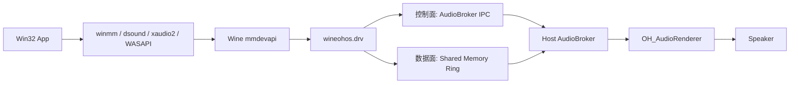
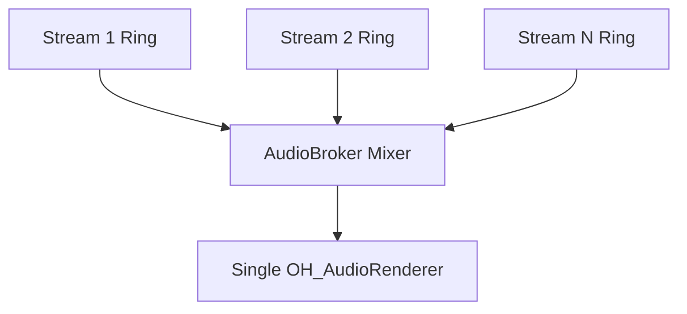

# WineHua 音频架构

> 更新日期: 2026-06-22

## 概览

当前音频方案只做一件事:

```text
把 Win32 程序输出的 PCM 音频稳定地桥接到宿主扬声器
```

主链路如下:



## 设计原则

- Wine 子进程不直接创建设备。
- 宿主 native 进程独占 `OH_AudioRenderer`。
- 控制面走 IPC，数据面走共享内存。
- callback 只做取数、混音、补零，不做阻塞操作。

## 分层

### Wine 侧

- `thirdparty/wine/dlls/wineohos.drv/ohos.c`
- `thirdparty/wine/dlls/wineohos.drv/ohos_audio_client.c`
- `thirdparty/wine/dlls/mmdevapi/client.c`

职责:

- 作为 `mmdevapi` backend 暴露 `wineohos.drv`
- 接收 Windows 共享模式音频流
- 将输入统一转换到固定混音格式
- 写入共享内存 ring buffer
- 通过控制协议完成 `OPEN / START / STOP / RESET / CLOSE / GET_STATUS`

### 宿主侧

- `entry/src/main/cpp/audio_broker.h`
- `entry/src/main/cpp/audio_broker.cpp`
- `entry/src/main/cpp/audio_ipc_server.h`
- `entry/src/main/cpp/audio_ipc_server.cpp`
- `entry/src/main/cpp/audio_stream.h`
- `entry/src/main/cpp/audio_stream.cpp`
- `entry/src/main/cpp/ring_buffer.h`
- `entry/src/main/cpp/ring_buffer.cpp`
- `shared/audio/audio_ipc_protocol.h`

职责:

- 管理 broker 生命周期
- 创建和管理 stream
- 为每个 stream 创建 memfd ring buffer
- 在 OHAudio callback 中读取并混音

## 控制面和数据面

### 控制面

控制面使用两级 fd 协议:

```text
App 启动前创建 bootstrap fd
  -> 注入到 Wine 环境变量
  -> Wine 初始化音频时创建 private socketpair
  -> 通过 bootstrap fd 把 private broker fd 发给宿主
  -> 后续命令全部走 private control channel
```

协议定义在:

- `shared/audio/audio_ipc_protocol.h`

当前命令:

- `HELLO`
- `OPEN_STREAM`
- `START`
- `STOP`
- `RESET`
- `CLOSE`
- `GET_STATUS`

### 数据面

每个 render stream 对应一块 ring buffer:


关键点:

- producer 只有 Wine 写端
- consumer 只有宿主读端
- `read_index / write_index` 用原子字段同步
- callback 不经过 socket，不经过额外拷贝链

## 固定混音格式

宿主固定混音格式:

```text
48000 Hz
stereo
s16le
```

对外行为:

- `GetMixFormat()` 返回固定 `48k / stereo / s16`
- Wine 侧把常见共享模式输入统一转换到这组格式

当前接受的输入范围:

- 采样率: `22050 / 44100 / 48000`
- 声道: `mono / stereo`
- 样本格式: `s16 / float32`

## 多进程混频

当前多进程混频是:



实现方式:

- 每个 Wine stream 一块独立 ring
- 宿主侧只有一个全局 `OH_AudioRenderer`
- callback 读取当前 snapshot 中所有 `started()` stream
- 混音时先累加到 `int32`，最后 clamp 回 `s16`

对应代码:

- stream 打开和生命周期: `entry/src/main/cpp/audio_broker.cpp`
- callback 混音: `AudioBroker::MixStreamsS16()` / `AudioBroker::OnWriteData()`

## 当前边界

当前版本只覆盖:

- render
- shared mode
- 默认播放设备
- 多 stream 混音

当前不做:

- capture
- exclusive mode
- multichannel output
- broader format negotiation

## TODO

- [ ] Soak test: underrun / overflow and multi-process mixing stability
- [ ] Format matrix: `WAV / MP3 / video audio track`
- [ ] Confirm non-audio Wine processes are not slowed by broker init
- [ ] Reduce control-plane overhead on the event-callback path
- [ ] If features expand later, add `capture`, `exclusive mode`, `multichannel output`, `broader PCM support`

## 调试入口

默认日志保留关键事件:

- broker 启动
- renderer ready
- open / start / stop / close
- 失败日志
- close / cleanup 统计

如需更详细的 Wine 日志，可通过:

- `WINEHUA_WINEDEBUG`

覆盖默认 `WINEDEBUG`。
