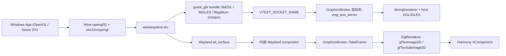

# OpenGL / VirGL Step 1 设计说明

> 更新日期: 2026-06-26

## 目标

在不要求 Windows 应用改动的前提下，让 Wine 内的 OpenGL 程序在 HarmonyOS 上跑通，并尽量复用现有 Wayland 窗口与上屏链路。

## 当前结论

- `x86_64 + HarmonyOS PC emulator` 上，`winehua_graphics_smoke.exe` 已能正确出图
- 3D 命令路径已经切到 `guest Mesa virpipe -> vtest socket -> virgl_test_server -> virglrenderer`
- 最终显示路径仍复用现有 `Wayland -> TakeFrame -> EglRenderer -> XComponent`
- 当前显示传输模式仍是 `wl_shm + cpu_copy + gl_upload`
- 当前不是零拷贝显示方案，也不是多窗口专项方案

## 当前架构

## 复用了什么

- 复用 Wine 现有 `WGL/EGL + winewayland.drv` OpenGL 路径，没有要求前端 Windows 程序做适配
- 复用现有内嵌 Wayland compositor、窗口模型、`EglRenderer` 上屏链路
- 复用现有 HNP/HAP 打包、运行时环境注入、日志采集流程

## 新增了什么

### 宿主侧

- `entry/src/main/cpp/graphics_broker.h`
- `entry/src/main/cpp/graphics_broker.cpp`

职责：

- 维护图形 backend 状态，当前支持 `shm` 和 `virgl`
- 启动 / 监控 `virgl_test_server`
- 探测 `libvirglrenderer.so` 和 `guest_gfx` bundle 是否齐全
- 给 Wine 进程注入 `WINEHUA_*` 和 `VTEST_SOCKET_NAME`
- 在宿主启动 `virgl_test_server` 时复用 guest bundle 里的 `libEGL.so.1 / libGLESv2.so`

### guest 3D receiver bundle

- `scripts/build_ohos_guest_gfx.sh`
- `scripts/build_guest_gfx.sh`
- `scripts/fetch_ohos_mesa.sh`
- `prebuilt/guest_gfx/README.md`

职责：

- 生成和打包 `guest_gfx` 运行时
- 让 Wine 的 OpenGL 路径优先加载 bundle 内的 Mesa 用户态库
- 当前 Step 1 默认模式是 `mesa-virpipe`

### 宿主 VirGL 运行时

- `thirdparty/virglrenderer/`
- `scripts/build_native.sh`
- `scripts/assemble.sh`

职责：

- 构建 `libvirglrenderer.so` 和 `virgl_test_server`
- 将宿主 VirGL 运行时打进 HNP
- 在 OHOS 上用 surfaceless EGL/GLES 跑起 host renderer

### 冒烟测试

- `thirdparty/wine/programs/winehua_graphics_smoke/`

职责：

- 作为一个真实 Windows x86 EXE 验证 WGL、像素格式、上下文创建、SwapBuffers 和实际画面输出
- 输出当前 backend / guest receiver / socket / library 等状态，方便直接对照日志

## 已完成

- `GraphicsBroker` 已接入宿主启动流程，并能给 Wine 注入图形环境变量
- `guest_gfx` bundle 已能随 HNP 一起打包和安装
- `virglrenderer + virgl_test_server` 已能在 OHOS 宿主侧启动
- 已为 `virglrenderer` 补上“无 GBM、仅 external EGL”的构建与运行支持
- 已新增 `winehua_graphics_smoke.exe`，可直接验证真实 Windows OpenGL 程序路径
- 已加上 Wine 侧和宿主侧的关键诊断日志，便于判断卡在库加载、socket、EGL 还是像素格式阶段
- 已完成 x86_64 模拟器上的 Step 1 OpenGL 正确出图验证

## 当前未完成

- 最终显示仍不是零拷贝，当前仍有 CPU copy 和 GL upload
- 没有做多窗口 GL 专项支持，当前以单窗口 smoke / 现有窗口链路为主
- 宿主侧 `virgl_renderer_init()` 进程内探针仍然关闭，避免 OHOS 下破坏宿主 EGL 状态
- 还没有实现专用的 Wine 3D 接收端改造；当前是“复用 Wine 现有 OpenGL 路径 + 替换运行时库”
- 还没有给 DX / Vulkan 做最终验证结论
- 还没有把 arm64 用户态作为主验证目标

## Wine 改了什么

### 已改文件

- `thirdparty/wine/dlls/win32u/opengl.c`
- `thirdparty/wine/dlls/winewayland.drv/opengl.c`
- `thirdparty/wine/programs/winehua_graphics_smoke/main.c`
- `thirdparty/wine/programs/winehua_graphics_smoke/Makefile.in`
- `thirdparty/wine/configure.ac`
- `thirdparty/wine/tools/makedep.c`

### 改动用途

- `dlls/win32u/opengl.c`
  - 新增 `WINEHUA_OPENGL_DIAG`
  - 打印 `libEGL` 加载、`eglGetConfigs`、像素格式数量等诊断信息

- `dlls/winewayland.drv/opengl.c`
  - 新增 `winehua_virgl_guest_probe`
  - 在 Wine guest 侧探测 `WINEHUA_VIRGL_SOCKET` 是否可连通
  - 用来区分“guest bundle 已接上”还是“仍在走 stock EGL”

- `programs/winehua_graphics_smoke/*`
  - 增加真实 Windows 图形冒烟测试程序
  - 直接验证 `ChoosePixelFormat / wglCreateContext / SwapBuffers`

- `configure.ac`
  - 把 `winehua_graphics_smoke` 纳入 Wine 构建系统

- `tools/makedep.c`
  - 修正新增 program 后触发的 install command 生成问题
  - 同时补了错误输出，方便排查构建期断点

## virglrenderer 改了什么

### 已改文件

- `thirdparty/virglrenderer/meson.build`
- `thirdparty/virglrenderer/meson_options.txt`
- `thirdparty/virglrenderer/src/vrend/vrend_winsys.c`

### 改动用途

- 允许“无 GBM、仅 external EGL”的构建方式
- 显式打开 `vtest` helper 构建，产出 `virgl_test_server`
- 在没有 GBM 的 OHOS 场景下，允许 `vrend` 走 `EGL_DEFAULT_DISPLAY + surfaceless + GLES`

## 源码管理要求

- `virglrenderer` 的 OHOS 适配修改应沉淀到独立 fork 仓库，再由主仓库以 submodule 指针引用
- guest receiver 侧的 Mesa / libdrm 应分别管理到 `thirdparty/mesa-ohos`、`thirdparty/libdrm-ohos`
- `scripts/build_ohos_guest_gfx.sh` 现在应优先消费 `thirdparty/` 下的受控源码，缺失时才 fallback 到 `tmp/` 抓取
- `prebuilt/guest_gfx/*` 只是打包产物，不能替代 Mesa / libdrm 源仓库本身

## 当前最重要的边界

- 这一步打通的是 OpenGL Step 1，不代表 DX 已经完成
- 当前 3D 命令路径和最终上屏路径是两段链路，不要把“VirGL 已接上”误解成“显示已经零拷贝”
- 当前方案的重点是“复用 Wine 现有路径”，不是新写一个私有 OpenGL 驱动

## 后续待办

- [ ] 把最终显示从 `wl_shm + cpu_copy + gl_upload` 推进到更高效路径
- [ ] 评估 `dmabuf / zero-copy` 是否能并入现有 compositor 和 `EglRenderer`
- [ ] 继续验证更多 OpenGL 程序，而不只是一支 smoke exe
- [ ] 评估 DX9/DX10/Direct3D 经 `wined3d` 走同一条 guest Mesa 路径的可行性
- [ ] 评估 Vulkan / Zink 路径是否要作为 Step 2
- [ ] 整理 Wine 补丁，区分“可上游”与“仅项目集成”两类

## 未来提交版本时的建议拆分

- 可考虑单独提交的通用修复
  - `thirdparty/virglrenderer/src/vrend/vrend_winsys.c`
  - `thirdparty/virglrenderer/meson.build`
  - `thirdparty/virglrenderer/meson_options.txt`
  - `thirdparty/wine/tools/makedep.c`

- 更适合项目内保留的改动
  - `GraphicsBroker`
  - `guest_gfx` build / package 脚本
  - `winehua_graphics_smoke`
  - `WINEHUA_*` 环境变量和诊断日志

- 需要清理后再评估是否上游的改动
  - `dlls/win32u/opengl.c` 中的诊断路径
  - `dlls/winewayland.drv/opengl.c` 中的 guest probe 逻辑
