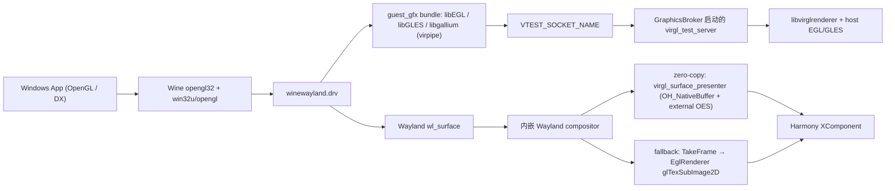

# OpenGL / VirGL 设计说明

> 更新日期: 2026-07-31
> 本文记录 VirGL/OpenGL 链路（Step 1 → Step 3）的设计与演进。后续又增加了
> Vulkan/DXVK 链路（见 [PHASE2_DXVK_STATUS_MEMO.md](../archive/PHASE2_DXVK_STATUS_MEMO.md)），
> 现为 OpenGL 程序的 fallback 渲染路径。

## 目标

在不要求 Windows 应用改动的前提下，让 Wine 内的 OpenGL 程序在 HarmonyOS 上跑通，并尽量复用现有 Wayland 窗口与上屏链路。

## 当前结论（2026-07-31 现状）

- 3D 命令路径已切到 `guest Mesa virpipe -> vtest socket -> virgl_test_server -> virglrenderer`
- **zero-copy 显示已落地**：virgl 生效时传输模式为 `virgl_texture+surface_queue+external_oes`
  （`virgl_surface_presenter.cpp` 把 OHNativeWindow producer 直接接进 virgl，`TakeFrame`/`EglRenderer`
  降为 CPU fallback），支持多窗口 per-surface zero-copy（surfaceKey 粒度 attach/detach）
- Wine 侧新增专用接收端：`winewayland.drv/wayland_surface_ohos.c`（读 `WINEHUA_ZERO_COPY_READY_DIR`）
  与 `opengl_readback.c`
- virgl 运行时支持三种启动方式：NCP 子进程、OH_IPC 远程代理（`OHIPCRemoteProxy`）、进程内 host
  （`StartVirglInProcessHostLocked`，phone 模式）
- Vulkan/DXVK 链路已合并为产品路径（guest DXVK 1.10.3 → Wine Vulkan → Venus → virglrenderer Venus
  → host Vulkan present），OpenGL 为显式 fallback

## 当前架构

## 复用了什么

- 复用 Wine 现有 `WGL/EGL + winewayland.drv` OpenGL 路径，没有要求前端 Windows 程序做适配
- 复用现有内嵌 Wayland compositor、窗口模型、`EglRenderer` 上屏链路
- 复用现有 HNP/HAP 打包、运行时环境注入、日志采集流程

## 新增了什么

### 宿主侧

- `entry/src/main/cpp/graphics/graphics_broker.h`
- `entry/src/main/cpp/graphics/graphics_broker.cpp`

职责：

- 维护图形 backend 状态，当前支持 `shm` 和 `virgl`
- 启动 / 监控 `virgl_test_server`
- 探测 `libvirglrenderer.so` 和 `guest_gfx` bundle 是否齐全
- 给 Wine 进程注入 `WINEHUA_*` 和 `VTEST_SOCKET_NAME`
- 在宿主启动 `virgl_test_server` 时复用 guest bundle 里的 `libEGL.so.1 / libGLESv2.so`

### guest 3D receiver bundle

- `scripts/build_ohos_guest_gfx.sh` — 从 `thirdparty/mesa` + `thirdparty/libdrm` 源码交叉编译 guest Mesa receiver（默认 `--platform wayland --mode virpipe`），产物 install 树在 `build/guest_gfx_install/<arch>/`，随后自动调用下面的打包脚本
- `scripts/build_guest_gfx.sh` — 不编译，只把现成的 OHOS Mesa install 树打包成 `build/guest_gfx/<arch>/`（供 `assemble.sh` 取用）
- `scripts/build_ohos_guest_vulkan.sh` — 构建 guest Vulkan 栈（Vulkan Loader + Mesa Venus ICD + venus 探针），产物在 `build/guest_vulkan/<arch>/`

职责：

- 生成和打包 `guest_gfx` 运行时：`scripts/assemble.sh` 把 `build/guest_gfx/<arch>/*` 拷进 `wine_data/bin/guest_gfx/`（随 wine-data.zip 分发），运行时解压到 `<files>/wine/bin/guest_gfx/`；GraphicsBroker 读该目录下的 `winehua-guest-gfx.env` 判定 receiver 是否就绪，并把 `guest_gfx/lib` 注入 Wine 的 `LD_LIBRARY_PATH`
- 让 Wine 的 OpenGL 路径优先加载 bundle 内的 Mesa 用户态库
- 当前 Step 1 默认模式是 `mesa-virpipe`

### 宿主 VirGL 运行时

- `thirdparty/virglrenderer/`
- `scripts/build_native.sh`
- `scripts/assemble.sh`

职责：

- 构建 `libvirglrenderer.so` 和 `virgl_test_server`
- 将宿主 VirGL 运行时打进 HNP
- 在 OHOS 上用 surfaceless EGL/GLES 跑起 host renderer

### 冒烟测试

- `thirdparty/wine/programs/winehua_graphics_smoke/`

职责：

- 作为一个真实 Windows x86 EXE 验证 WGL、像素格式、上下文创建、SwapBuffers 和实际画面输出
- 输出当前 backend / guest receiver / socket / library 等状态，方便直接对照日志

## 宿主 ↔ guest 环境变量契约

宿主侧 `GraphicsBroker::AppendWineEnv()`（`entry/src/main/cpp/graphics/graphics_broker.cpp`）在启动 Wine 进程时注入以下变量，guest 侧（Wine / smoke 程序）按需读取。**契约以本节为准**，两侧代码均直接写字面量字符串。历史上曾存在共享头 `shared/graphics/graphics_runtime_env.h` 统一宏名，但宿主侧实际未包含它，已于 2026-07 移除；wine 树内的 `programs/winehua_graphics_smoke/graphics_runtime_env.h` 仍保留（同样未被包含，仅供参考）。

### 所有模式都会注入

| 变量 | 取值 | 含义 |
| --- | --- | --- |
| `WINEHUA_GRAPHICS_BACKEND` | `shm` / `virgl` | 请求的图形 backend |
| `WINEHUA_GRAPHICS_ACTIVE` | `shm` / `virgl` | 实际生效的 backend |
| `WINEHUA_SHM_FALLBACK` | `0` / `1` | 是否回落到了 shm 路径 |
| `WINEHUA_FRAME_ZERO_COPY` | `0` / `1` | 零拷贝帧路径是否生效 |
| `WINEHUA_FRAME_TRANSPORT` | 字符串 | 显示传输模式，如 `wl_shm+cpu_copy+gl_upload`、`virgl_texture+surface_queue+external_oes` |
| `WINEHUA_VULKAN_PRESENT` | `1` | Vulkan present 模式（`vulkanPresentMode_` 为真时注入，DXVK/Venus 链路） |
| `WINEHUA_GUEST_GFX_READY` | `0` / `1` | guest_gfx receiver bundle 是否就绪 |
| `WINEHUA_GUEST_GFX_MODE` | `mesa-virpipe` / `stock-egl` | guest 3D receiver 模式 |
| `WINEHUA_GUEST_GFX_DIR` | 路径 | bundle 运行时目录（仅在非空时注入） |
| `WINEHUA_VIRGL_SOCKET_READY` | `0` / `1` | vtest socket 是否就绪 |
| `WINEHUA_VIRGL_LIBRARY_READY` | `0` / `1` | `libvirglrenderer.so` 是否就绪 |
| `WINEHUA_VIRGL_SOCKET` | 路径 | vtest socket 路径（仅在非空时注入；`winewayland.drv` 的 guest probe 也读它） |
| `WINEHUA_VIRGLRENDERER_LIB` | 路径 | 宿主 virglrenderer 库路径（仅在非空时注入） |
| `WINEHUA_VIRGL_READY` | `0` / `1` | virgl backend 是否已激活 |
| `WINEHUA_GRAPHICS_NOTE` | 字符串 | 最近一次错误信息（仅在非空时注入） |

### 仅 virgl 模式注入

| 变量 | 取值 | 含义 |
| --- | --- | --- |
| `EGL_PLATFORM` | `wayland` | 强制 Mesa 走 wayland 平台 |
| `WINEHUA_EGL_LIBRARY_PATH` | 路径 | 指定 guest bundle 内的 `libEGL.so`（`win32u/opengl.c` 读取） |
| `BOX64_EMULATED_LIBS` | 库名列表 | 让 box64 模拟 guest GL / wayland 相关库 |
| `LIBGL_DRIVERS_PATH` / `EGL_DRIVERS_PATH` | 路径 | Mesa DRI / EGL driver 搜索路径（目录存在才注入） |
| `WINEHUA_WAYLAND_READBACK` | `1` | 打开 wayland 帧回读（`winewayland.drv/opengl.c` 读取） |
| `WINEHUA_GL_STALL_DIAG` | `1` | 打开 GL 卡顿诊断日志 |
| `WINEHUA_DISPLAY_FPS_FILE` | Windows 路径 | guest 侧 FPS 统计输出文件 |
| `WINEHUA_VTEST_FRONTBUFFER_LOG` | 路径 | vtest frontbuffer 日志 |
| `WINEHUA_VTEST_PRESENT` | `surface-queue` | vtest present 模式 |
| `WINEHUA_ZERO_COPY_READY_DIR` | 路径 | 零拷贝就绪标记目录（`winewayland.drv/opengl.c` 读取） |
| `VTEST_SOCKET_NAME` | 路径 | guest Mesa virpipe 连接 vtest server 的 socket 名 |

另有 `guestReceiverEnv_` 里由 bundle manifest 带入的追加变量，原样透传。

### 仅宿主侧使用（不注入 guest）

| 变量 | 读取方 | 含义 |
| --- | --- | --- |
| `WINEHUA_VIRGL_SYNC_MODE` | `graphics_broker.cpp` / `virgl_child.cpp` | `virgl_test_server` 同步模式，默认 `egl-thread` |
| `WINEHUA_VIRGL_LOG_PATH` | `virgl_child.cpp` | virgl 子进程日志路径 |
| `WINEHUA_GRAPHICS_BACKEND` | `graphics_broker.cpp` | 宿主自身也读取，作为请求 backend 的覆盖入口 |
| `WINEHUA_VIRGLRENDERER_LIB` | `graphics_broker.cpp` | 宿主探测阶段的库路径覆盖 |

### smoke 程序的历史遗留读取

`winehua_graphics_smoke/main.c` 还读取 `WINEHUA_FRAME_PRESENTER`、`WINEHUA_FRAME_DAMAGE_UPLOAD`、`WINEHUA_NATIVE_BUFFER_AVAILABLE`、`WINEHUA_FRAME_FALLBACK`、`WINEHUA_GRAPHICS_FORCE_GL`，当前宿主均不注入，读到恒为空，仅作状态展示。新增变量时以 `AppendWineEnv()` 实际注入项为准。

## 已完成

- `GraphicsBroker` 已接入宿主启动流程，并能给 Wine 注入图形环境变量
- `guest_gfx` bundle 已能随 HNP 一起打包和安装
- `virglrenderer + virgl_test_server` 已能在 OHOS 宿主侧启动
- 已为 `virglrenderer` 补上“无 GBM、仅 external EGL”的构建与运行支持
- 已新增 `winehua_graphics_smoke.exe`，可直接验证真实 Windows OpenGL 程序路径
- 已加上 Wine 侧和宿主侧的关键诊断日志，便于判断卡在库加载、socket、EGL 还是像素格式阶段
- 已完成 x86_64 模拟器上的 Step 1 OpenGL 正确出图验证

## 演进记录（原"当前未完成"项均已落地）

- 零拷贝显示：已落地（surface-queue + external OES，见上）
- 多窗口 GL 专项支持：已做（per-surface zero-copy attach/detach、`QueryVirglSurfaces`）
- 进程内 `virgl_renderer_init()` 探针：已启用（`StartVirglInProcessHostLocked`，phone 模式）
- 专用 Wine 3D 接收端：已实现（`wayland_surface_ohos.c` + `opengl_readback.c`）
- DX / Vulkan 验证结论：已出（DXVK 1.10.3 stable baseline，双设备 suite PASS）
- arm64 用户态主验证目标：已是当前调试目标

## Wine 改了什么

### 已改文件

- `thirdparty/wine/dlls/win32u/opengl.c`
- `thirdparty/wine/dlls/winewayland.drv/opengl.c`
- `thirdparty/wine/programs/winehua_graphics_smoke/main.c`
- `thirdparty/wine/programs/winehua_graphics_smoke/Makefile.in`
- `thirdparty/wine/configure.ac`
- `thirdparty/wine/tools/makedep.c`

### 改动用途

- `dlls/win32u/opengl.c`
  - 新增 `WINEHUA_OPENGL_DIAG`
  - 打印 `libEGL` 加载、`eglGetConfigs`、像素格式数量等诊断信息

- `dlls/winewayland.drv/opengl.c`
  - 新增 `winehua_virgl_guest_probe`
  - 在 Wine guest 侧探测 `WINEHUA_VIRGL_SOCKET` 是否可连通
  - 用来区分“guest bundle 已接上”还是“仍在走 stock EGL”

- `programs/winehua_graphics_smoke/*`
  - 增加真实 Windows 图形冒烟测试程序
  - 直接验证 `ChoosePixelFormat / wglCreateContext / SwapBuffers`

- `configure.ac`
  - 把 `winehua_graphics_smoke` 纳入 Wine 构建系统

- `tools/makedep.c`
  - 修正新增 program 后触发的 install command 生成问题
  - 同时补了错误输出，方便排查构建期断点

## virglrenderer 改了什么

### 已改文件

- `thirdparty/virglrenderer/meson.build`
- `thirdparty/virglrenderer/meson_options.txt`
- `thirdparty/virglrenderer/src/vrend/vrend_winsys.c`

### 改动用途

- 允许“无 GBM、仅 external EGL”的构建方式
- 显式打开 `vtest` helper 构建，产出 `virgl_test_server`
- 在没有 GBM 的 OHOS 场景下，允许 `vrend` 走 `EGL_DEFAULT_DISPLAY + surfaceless + GLES`

## 源码管理要求

- `virglrenderer` 的 OHOS 适配修改应沉淀到独立 fork 仓库，再由主仓库以 submodule 指针引用
- guest receiver 侧的 Mesa / libdrm 应分别管理到 `thirdparty/mesa`、`thirdparty/libdrm`
- `scripts/build_ohos_guest_gfx.sh` 现在应优先消费 `thirdparty/` 下的受控源码（`WINEHUA_OHOS_MESA_SOURCE_ROOT` / `WINEHUA_OHOS_LIBDRM_SOURCE_ROOT`），缺失时才 fallback 到 `tmp/` 抓取
- `build/guest_gfx/<arch>/*` 只是打包产物，不能替代 Mesa / libdrm 源仓库本身

## 当前最重要的边界

- OpenGL 链路现在是 **fallback**：DXVK 稳定后 D3D11 走 Vulkan 链路，OpenGL 程序走本文链路
- 3D 命令路径与上屏路径仍是两段链路，zero-copy 只覆盖 virgl backend
- 方案重点是“复用 Wine 现有路径”，不是新写一个私有 OpenGL 驱动

## 后续待办

- [ ] 继续验证更多 OpenGL 程序，而不只是一支 smoke exe
- [ ] 整理 Wine 补丁，区分“可上游”与“仅项目集成”两类

## 未来提交版本时的建议拆分

- 可考虑单独提交的通用修复
  - `thirdparty/virglrenderer/src/vrend/vrend_winsys.c`
  - `thirdparty/virglrenderer/meson.build`
  - `thirdparty/virglrenderer/meson_options.txt`
  - `thirdparty/wine/tools/makedep.c`

- 更适合项目内保留的改动
  - `GraphicsBroker`
  - `guest_gfx` build / package 脚本
  - `winehua_graphics_smoke`
  - `WINEHUA_*` 环境变量和诊断日志

- 需要清理后再评估是否上游的改动
  - `dlls/win32u/opengl.c` 中的诊断路径
  - `dlls/winewayland.drv/opengl.c` 中的 guest probe 逻辑
